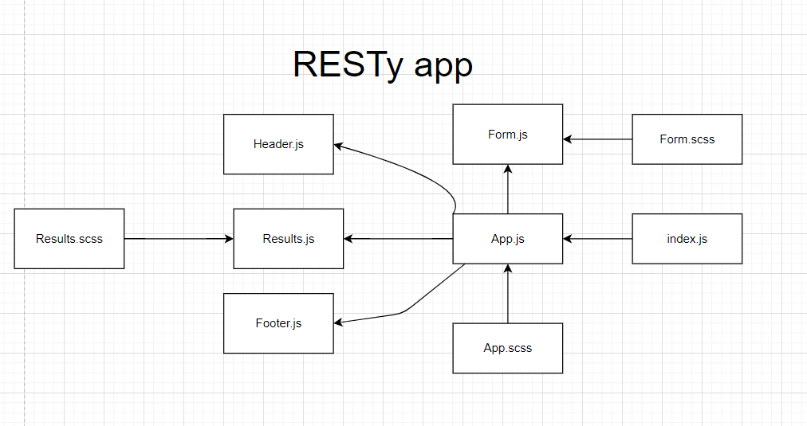

# RESTyAPI
an API testing tool that can be run in any browser, allowing a user to easily interact with APIs in a familiar interface.

## LAB - 27: Props and Stats
* Deployment: [RESTy App](https://6096186d7bf753989d4bafb3--friendly-albattani-592e0e.netlify.app/)
* Author: Boshra Jaber
* Setup: 
  - To create a react app: `npx create-react-app app-name`
  - another way by adding npm flag: `npx create-react-app app-name --use-npm`
  - Remove the .git file so you don't have nested repo: `rm -rf .git`
  - To start the app: `npm start`
  - To use Sacc for styling: `npm i node-sass`
  - To get the data from the API: `npm i superagent`

## Testing the app:
1. Provide the API URL you want to test in the input field.
2. choose the rest method.
3. Click on GO! to see the results.
## UML

